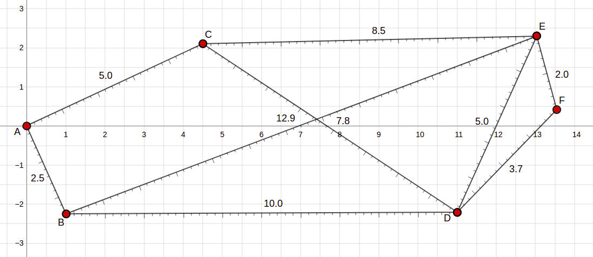

# Robot Navigation Simulator

## 16520373 / 13520110 - Farrel Ahmad

## Temporary Readme File

### Robot Shortest Path Navigation Simulator using Gazebo Simulator with ROS (Robot Operating System). Tugas Challenge SPARTA HMIF 2020.

<br>

## Introduction

**9 August 2021 Update-2**

This simulation utilizes dijkstra algorithm to find the shortest path from vertex to vertex. The algorithm is implemented in Gazebo Simulator using ROS Noetic with Turtlebot3 Burger as the robot. 

Note that in this program, a node refers to a ROS Node while a vertex refers to a point (A or 0 for example) on the route map. Also, note that in this program's adjacency matrix, vertex A is 0, vertex B is 1, vertex C is 2, and so forth. The standard length unit in Gazebo Simulator is in meter.

<br>

## Route Map
**9 August 2021 Update-1**

<br>



Route Map (Unit in Meters)


<br>

## Launching World
**29 July 2021 Update-1**
1. This program is being developed using ROS Noetic, Gazebo 11, and Ubuntu 20.04 LTS. Try to use these version.

2. Clone the repository
```
$ git clone https://github.com/farrel-a/robot-nav-simulator.git
```

3. cd to `/robot-nav-simulator/nav_ws`
```
$ cd robot-nav-simulator/nav_ws
```

4. run `catkin_make`
```
$ catkin_make
```

5. source `setup.bash`
```
$ source devel/setup.bash
```

6. run launch command
```
$ roslaunch navrobot_gazebo navrobot.launch
```

~~**9 August 2021 Update-1**~~

**9 August 2021 Update-2**

7. Start a new terminal and source setup.bash
```
$ source devel/setup.bash
```

8. On new terminal, run this command and feel free to fill the argument with any value of `src` and `end`. `src` (source) is the starting vertex and `end` is the destination vertex. The value must be 0<=(`src`,`end`)<=5. For example, start at vertex 0/A and go to vertex 5/F.

```
$ rosrun navrobot_gazebo robot_1 _src:=0 _end:=5
```

9. The robot will be spawned at `src`'s vertex position 

**10 August 2021 Update-2**

10. The terminal will show information as follows


- `ER` (En Route) : the vertex that the robot is currently going to.
- `GX` (Goal_X) : x position of the current destinated vertex.
- `GY` (Goal_Y) : y position of the current destinated vertex.
- `X` : x position of the robot.
- `Y` : y position of the robot.

~~**30 July 2021 Update-1**~~

11. The result will look like this. It will spawn turtlebot3_burger at x = 0.0, y = 0.0, z = 0.0 and then go to the nearest route from vertex `src` to vertex `end`.


12. Use ctrl+c on the terminal to stop the node. You can also try again and run the node with different argument value. Just redo the step no.8.

**10 August 2021 Update-1**

13. Now the world has a simple route model (true scale)

