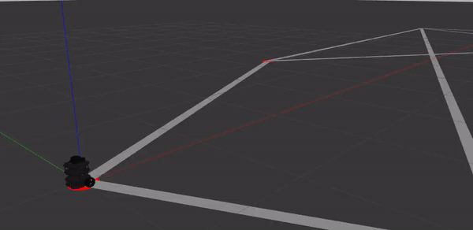

# Robot Navigation Simulator

## 16520373 / 13520110 - Farrel Ahmad

### Robot Shortest Path Navigation Simulator using Gazebo Simulator with ROS (Robot Operating System). 
### Tugas Challenge SPARTA HMIF 2020 
### Paper Matematika Diskrit 2021
### Paper Strategi Algoritma 2022

<br>

## Table of Contents
- [Introduction](#intro)

Tugas Challenge SPARTA HMIF 2020
- [Dijkstra Navigation](#DN)
    - [Route Map (Dijkstra Navigation)](#DN)
    - [Launching World (Dijkstra Navigation)](#LWRM)

Paper Matematika Diskrit 2021
- [Dijkstra Obstacle Avoidance](#RMDO)
    - [Route Map (Dijkstra Obstacle Avoidance)](#RMDO)
    - [Launching World (Dijkstra Obstacle Avoidance)](#LWOA)

Paper Strategi Algoritma 2022
- [Proportional Controller Motion Planner](#PCON)
    - [Launching World (P-Controller Motion Planner)](#LWPCON)


- [References](#ref)

<br>

## Introduction <a name="intro"></a>

This simulation is a base for robot navigation simulation. There are two main navigation functionality implemented in the simulator, path planner (dijkstra), and motion planner (P-Controller). The algorithm is implemented in Gazebo Simulator using ROS Noetic with Turtlebot3 Burger as the robot. 

Note that in this path planner program, a node refers to a ROS Node while a vertex refers to a point (A or 0 for example) on the route map. Also, note that in this program's adjacency matrix, vertex A is 0, vertex B is 1, vertex C is 2, and so forth. The standard length unit in Gazebo Simulator is in meter.

For motion planner program. The program utilizes Proportional Controller algorithm to generate velocity command to the robot as a step by step velocity to reach certain position.

<br>

## Route Map (Dijkstra Navigation)  <a name="DN"></a>

<br>


Route Map (Unit in Meters)

<br>


Route Map on Gazebo Simulator

<br>

## Launching World (Dijkstra Navigation) <a name="LWRM"></a>
1. This program is being developed using ROS Noetic, Gazebo 11, and Ubuntu 20.04 LTS. Try to use these version.

2. Clone the repository
```
$ git clone https://github.com/farrel-a/robot-nav-simulator.git
```

3. cd to `/robot-nav-simulator/nav_ws`
```
$ cd robot-nav-simulator/nav_ws
```

4. run `catkin_make`
```
$ catkin_make
```

5. source `setup.bash` for bash or `setup.zsh` for zsh
```
$ source devel/setup.bash
```
or
```
$ source devel/setup.zsh
```

6. run launch command
```
$ roslaunch navrobot_gazebo navrobot.launch
```

7. Start a new terminal and source `setup.bash` or `setup.zsh`
```
$ source devel/setup.bash
```
or
```
$ source devel/setup.zsh
```


8. On a new terminal, run this command and feel free to fill the argument with any value of `src` and `end`. `src` (source) is the starting vertex and `end` is the destination vertex. The value must be 0<=(`src`,`end`)<=5. For example, start at vertex 0/A and go to vertex 5/F.

```
$ rosrun navrobot_gazebo robot_1 _src:=0 _end:=5
```

9. The robot will be spawned at `src`'s vertex position 

10. The terminal will show information as follows


- `ER` (En Route) : the vertex that the robot is currently going to.
- `GX` (Goal_X) : x position of the current destinated vertex.
- `GY` (Goal_Y) : y position of the current destinated vertex.
- `X` : x position of the robot.
- `Y` : y position of the robot.

11. The result will look like this. It will spawn turtlebot3_burger at x = 0.0, y = 0.0, z = 0.0 and then go to the nearest route from vertex `src` to vertex `end`.




12. Use ctrl+c on the terminal to stop the node. You can also try again and run the node with different argument value. Just redo the step no.8.

<br>
<br>

## Route Map (Dijkstra Obstacle Avoidance) <a name="RMDO"></a>


Route Map

<br>


Route Map (Expanded Obstacle)

<br>

## Launching World (Obstacle Avoidance)<a name="LWOA"></a>
1. This program is being developed using ROS Noetic, Gazebo 11, and Ubuntu 20.04 LTS. Try to use these version.

2. Clone the repository
```
$ git clone https://github.com/farrel-a/robot-nav-simulator.git
```

3. cd to `/robot-nav-simulator/nav_ws`
```
$ cd robot-nav-simulator/nav_ws
```

4. run `catkin_make`
```
$ catkin_make
```

5. source `setup.bash` for bash or `setup.zsh` for zsh
```
$ source devel/setup.bash
```
```
$ source devel/setup.zsh
```

6. run launch command
```
$ roslaunch navrobot_gazebo obsrobot.launch
```

7. Start a new terminal and source `setup.bash` or `setup.zsh`
```
$ source devel/setup.bash
```
or
```
$ source devel/setup.zsh
```

8. On a new terminal, run this command to run the robot's program

```
$ rosrun navrobot_gazebo robot_2
```

9. The robot will be spawned at Node S vertex position (0.0, 0.0)


10. The terminal will show information as follows


`Prev List` : The nearest node of each node (from index-0 (Node S) to index-13 (Node GL))

`Node Sequence` : Robot path sequence


Robot in Action!

11. The node will stop automatically once arrived at the goal position (1.5, 1.5)

<br>

## Proportional Controller Motion Planner <a name="PCON"></a>

<br>

## Launching World (P-Controller Motion Planner) <a name="LWPCON"></a>


one tile = 1m x 1m

1. This program is being developed using ROS Noetic, Gazebo 11, and Ubuntu 20.04 LTS. Try to use these version.

2. Clone the repository
```
$ git clone https://github.com/farrel-a/robot-nav-simulator.git
```

3. cd to `/robot-nav-simulator/nav_ws`
```
$ cd robot-nav-simulator/nav_ws
```

4. run `catkin_make`
```
$ catkin_make
```

5. source `setup.bash` for bash or `setup.zsh` for zsh
```
$ source devel/setup.bash
```
```
$ source devel/setup.zsh
```

6. run launch command
```
$ roslaunch navrobot_gazebo PConRobot.launch
```

7. Start a new terminal and source `setup.bash` or `setup.zsh`
```
$ source devel/setup.bash
```
or
```
$ source devel/setup.zsh
```

8. On a new terminal, run this command to run the robot's program

```
$ rosrun navrobot_gazebo robot_3 _x_goal:=1.0 _y_goal:=1.0 _Kp_lin:=0.35 _Kp_rot:=0.45
```

9. _x_goal, _y_goal can also be changed to other position. _Kp_lin is a Kp constant for linear velocity and _Kp_rot is Kp constant for angular velocity. _Kp_lin and _Kp_rot can also be changed.

10. The terminal will show GX (Goal X), GY (Goal Y), current X, and current Y pose of the robot.


11. IN ACTION !!!


## References <a name="ref"></a>
- educative/Edpresso Team. 2021. *How to implement Dijkstra's Algorithm in C++*. https://www.educative.io/edpresso/how-to-implement-dijkstras-algorithm-in-cpp. Accessed on 9 August 2021.

- WilliamFiset. 2018. *Dijkstra's Shortest Path Algorithm | Graph Theory*. https://www.youtube.com/watch?v=pSqmAO-m7Lk&t=785s. Accessed on 9 August 2021.

- ROS.org. 2021. *ROS Documentation*. http://wiki.ros.org/. Accessed on 9 August 2021.

- ROBOTIS. 2021. *ROBOTIS-GIT/turtlebot3*. https://github.com/ROBOTIS-GIT/turtlebot3. Accessed on 29 July 2021.

- Shikin Zhang. 2016. *PID Pseudocode*. https://shikinzhang.github.io/2016/07/25/PD-Controller/. Accessed on 21 May 2022.
